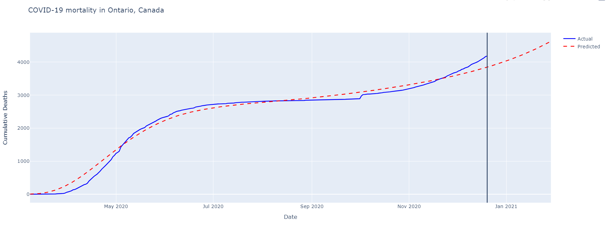
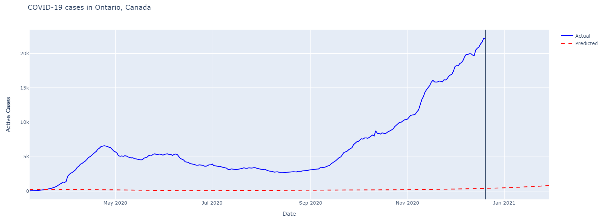
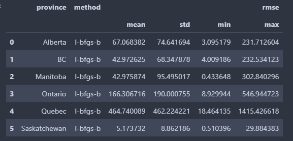
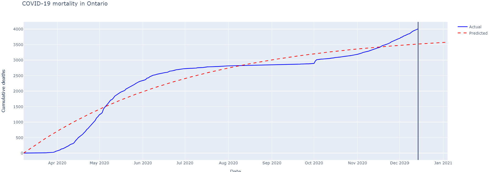
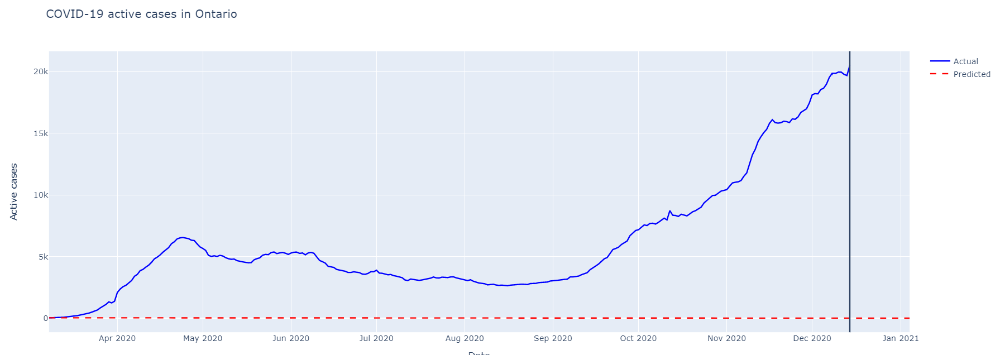
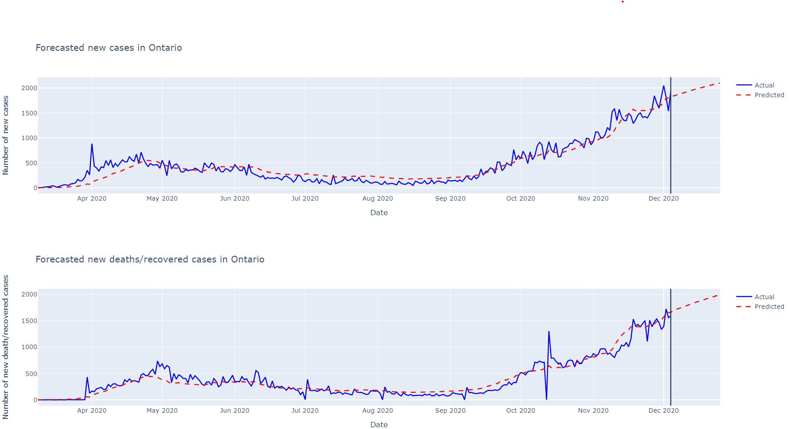
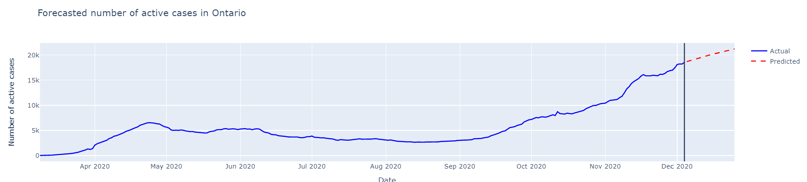
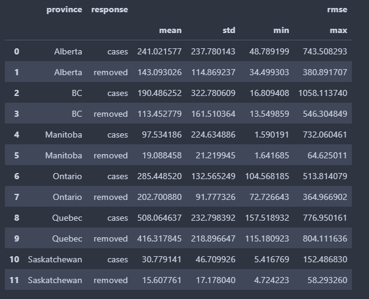

```{r setup, include=FALSE}
knitr::opts_chunk$set(echo = FALSE)
```


# SEIR Compartment model


## Model definition

- 4 compartments - Susceptible, Exposed, Infected, and Removed

### ODEs:

$$
\begin{aligned}
\frac{dS}{dt} &= -\frac{\beta IS}{N} \\
\frac{dE}{dt} &= \frac{\beta IS}{N} - \alpha E \\ 
\frac{dI}{dt} &= \alpha E - \gamma I \\ 
\frac{dR}{dt} &= \gamma I
\end{aligned}
$$


## 1 - YGG SEIR simulator

- Varying rate of reproduction $R_0$ over time.
- Can specify initial and lockdown $R_0$
- More difficult to adapt

- Loss function:
$$L(\theta, R) = \sum_{t=1}^{T} (\hat{R_t} - R_t)^2$$
- Estimate parameters with L-BFGS-B, bayesian optimization, grid search.


## Results

{width=800px height=500px}

## Results
{width=800px height=500px}

## Results



## 2 - Initial value solver

- Define ODEs and run some ivp solver
- Easier to change and experiment 
- Similar approach to https://covid19.uclaml.org/model.html UCLAML

- Loss function
$$L(\theta, I, R) = \sum_{t=1}^{T} (\lambda (\hat{R_t} - R_t)^2 + (1 - \lambda) (\hat{I_t} - I_t)^2)$$
- Set initial values to current known values in data
- Estimate parameters using similar methods as before


## Results 
- $\lambda = 0.5$

{width=800px height=450px}


## Results
- $\lambda = 0.5$

{width=800px height=450px}


## Suggested work

- Continue with IVP method
- Add time varying parameters $\beta_t$, $\alpha_t$, $\gamma_t$
- Add extra compartments


# Poisson regression


## Model definition

- New cases modeled as
$$
Y_t \sim Poisson(\mu_t) \\
log(\mu_t) = \beta_{1} + \beta_{2}log(I_{t-1} + 1) + \alpha log(S_{t-1}/N) 
$$

- New deaths/recovered cases modeled as
$$
\Delta D_t \sim Poisson({\mu_t}^D) \\
log({\mu_t}^D) = \beta_{1}^D + \beta_{2}^D log(I_{t-1} + 1)
$$


## Parameter estimation

- Maximum likelihood estimation with regularization

$$L(\theta, X, Y) = \sum_{t=1}^{T} log(p(y_i ; e^{\theta^T x_i})) - \lambda \theta^T \theta$$

## Results

{width=800px height=500px}


## Results

{width=800px height=250px}

## Results




## Suggested work

- Time varying parameters. For example

if $t \leq c$
$$log(\mu_t) = \beta_{1} + \beta_{2}log(I_{t-1} + 1) + \alpha log(S_{t-1}/N)$$
otherwise
$$log(\mu_t) = \beta_{1} + \beta_{2}^* log(I_{t-1} + 1) + \alpha^* log(S_{t-1}/N)$$


