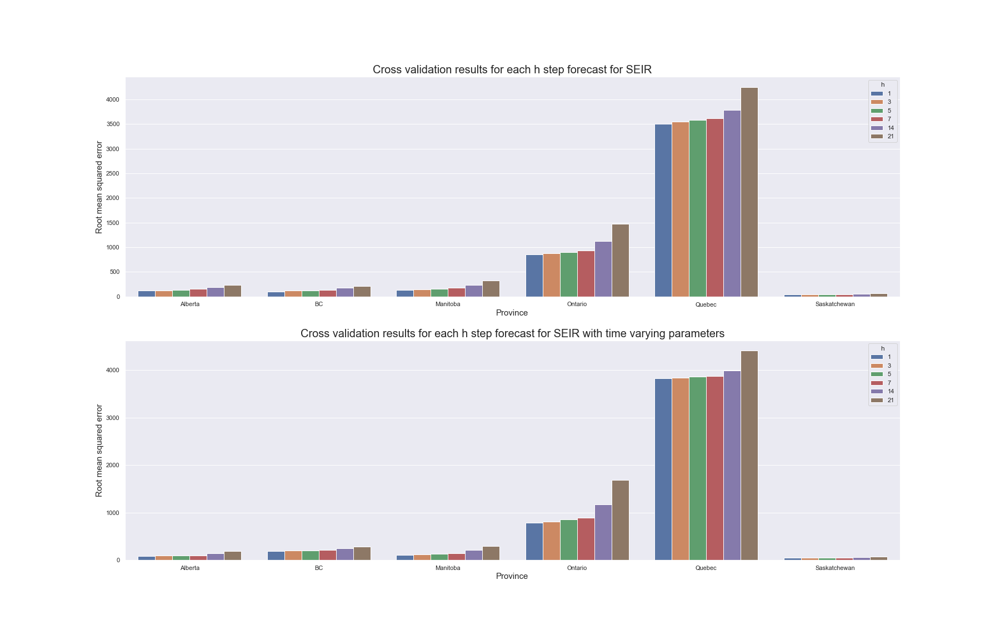

```{r setup, include=FALSE}
knitr::opts_chunk$set(echo = FALSE)
```


# SEIR Compartment model


## Model definition

- 4 compartments - Susceptible, Exposed, Infected, and Removed

- ODEs:

$$
\begin{aligned}
\frac{dS}{dt} &= -\frac{\beta IS}{N} \\
\frac{dE}{dt} &= \frac{\beta IS}{N} - \alpha E \\ 
\frac{dI}{dt} &= \alpha E - \gamma I \\ 
\frac{dR}{dt} &= \gamma I
\end{aligned}
$$

- Current approach with time dependent parameter $\beta(t)$ to handle government policies


## Parameter estimation

- Loss function

$$L(\theta, I, R) = \sum_{t=1}^{T} (\lambda (\hat{R_t} - R_t)^2 + (1 - \lambda) (\hat{I_t} - I_t)^2)$$

- IVP solver

- Black box optimization methods


## Results 

{width=800px height=300px}

## Results

{width=800px height=300px}

## Results
{width=800px height=500px}


# Poisson regression

## Model definition

- New cases modeled as
$$
Y_t \sim Poisson(\mu_t) \\
log(\mu_t) = \beta_{1} + \beta_{2}log(I_{t-1} + 1) + \alpha log(S_{t-1}/N) 
$$

- New deaths/recovered cases modeled as
$$
\Delta D_t \sim Poisson({\mu_t}^D) \\
log({\mu_t}^D) = \beta_{1}^D + \beta_{2}^D log(I_{t-1} + 1)
$$
- Experimenting with time dependent parameters $\beta(t)$ to handle government policies


## Parameter estimation

- Maximum likelihood estimation with regularization

$$L(\theta, X, Y) = \sum_{t=1}^{T} log(p(y_i ; e^{\theta^T x_i})) - \lambda \theta^T \theta$$


## Results

{width=800px, height=500px}


## Results

{width=800px height=250px}

{width=800px height=250px}


## Results

{width=800px height=250px}


